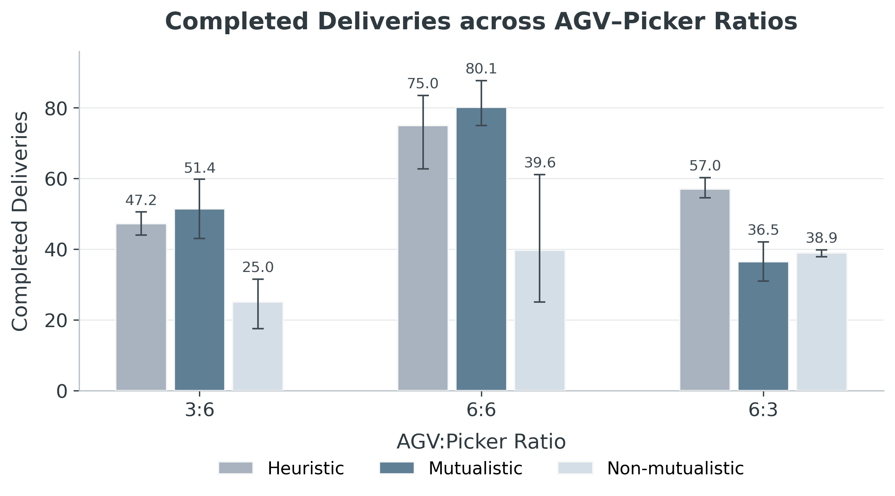
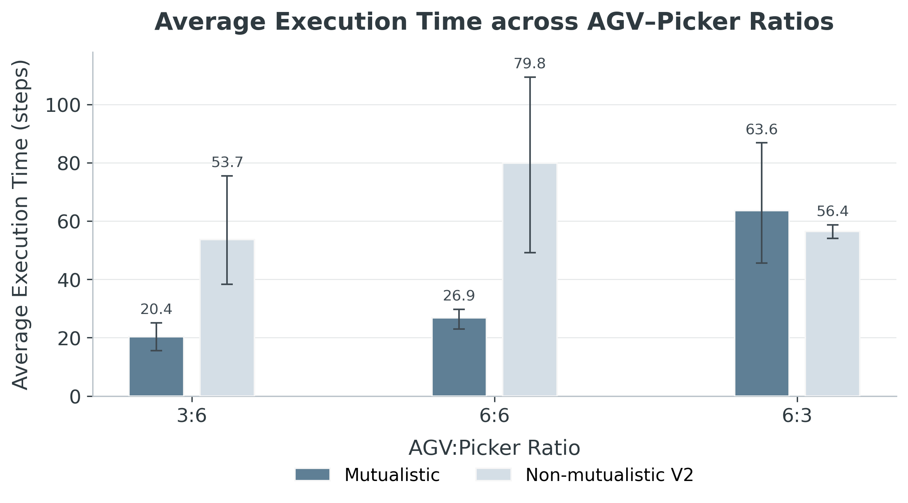
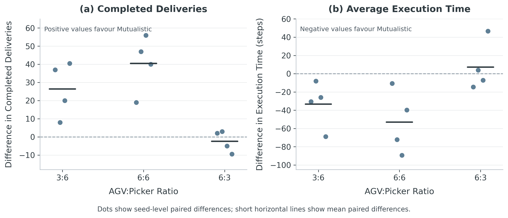

# Adaptive Symbiotic Information-Sharing (ASIS)

**Adaptive Symbiotic Information-Sharing Framework Using Large Language Models for Heterogeneous Multi-Robot Collaboration**

This repository accompanies a master thesis on AGV--picker coordination in a TA-RWARE-style warehouse environment. The project studies whether allowing picker-side evaluation to influence AGV-side commitment before execution can improve heterogeneous task allocation and coordination.

## Thesis

Author: Liu Yang  
Programme: M.Sc. Computer Science, Uppsala University  

Thesis link: [Add thesis link here]

## Project Overview

The warehouse task involves heterogeneous agents with different roles:

- **AGVs** transport racks between storage cells and goal locations.
- **Pickers** support AGVs during cooperative LOAD and UNLOAD operations.
- **Requested racks** are racks currently required by the warehouse request queue.
- **Goal locations** are delivery points where requested racks are completed.
- **Empty rack locations** are storage cells where delivered racks can be returned.

The main research question is whether a mutualistic staged LLM planner improves coordination compared with a non-mutualistic staged LLM baseline, where the AGV side commits first and the picker side only responds afterward.

## Coordination Methods

### Mutualistic Staged LLM Planner

The mutualistic planner uses a three-stage coordination process:

1. **AGV-side proposal:** proposes a primary rack and backup rack options.
2. **Picker-side support evaluation:** evaluates whether the proposed options can be supported.
3. **Final commitment:** retains the primary target, revises to a backup target, or skips the request.

Main planner file:

```text
src/symco/planners/mutualistic_llm_planner.py
````

Main runner:

```text
scripts/run_mutualistic_llm.py
```

### Non-Mutualistic Staged LLM Baseline

The non-mutualistic baseline keeps a staged structure, but picker-side evaluation cannot revise the AGV-side target.

1. **AGV-side commitment:** commits to one rack target.
2. **Picker-side ACK/BUSY response:** evaluates only the committed target.
3. **Deterministic integration:** forms an assignment or skips the request.

Main planner file:

```text
src/symco/planners/non_mutualistic_llm_planner.py
```

Main runner:

```text
scripts/run_non_mutualistic_llm.py
```

### Heuristic Baseline

The heuristic baseline is used as a deterministic warehouse reference. It is derived from the predefined TA-RWARE heuristic policy and wrapped in this project to collect thesis-specific metrics.

On the AGV side, requested items are assigned to the closest available AGV. The AGV then follows picking, delivery, and returning missions. On the picker side, warehouse rack groups are split into picker-related sections, and picker support is dispatched according to the section of the AGV mission target.

The heuristic is used as an external domain-grounded reference, not as the main architectural baseline.

## Repository Structure

```text
.
├── scripts/
│   ├── run_mutualistic_llm.py
│   ├── run_non_mutualistic_llm.py
│   └── ...
├── src/
│   └── symco/
│       ├── core/
│       ├── llm/
│       ├── planners/
│       └── run/
├── task-assignment-robotic-warehouse/
├── outputs/
├── docs/
│   └── figures/
└── README.md
```

## Installation

Create and activate a Python environment:

```bash
python3 -m venv .venv
source .venv/bin/activate
```

Install dependencies:

```bash
python3 -m pip install -r requirements.txt
```

The experiments require the TA-RWARE environment and an LLM backend compatible with the planner client configuration.

## LLM Backend

The LLM-based planners require a model server or API compatible with the code under:

```text
src/symco/llm/
```

Before running LLM experiments, make sure the LLM backend and configuration are available.

## Running Experiments

### Mutualistic Planner

```bash
python3 scripts/run_mutualistic_llm.py \
  --env_id tarware-medium-6agvs-6pickers-partialobs-v1 \
  --num_seeds 4 \
  --repeats_per_seed 2 \
  --seed 0 \
  --max_steps 1000 \
  --out_dir outputs/mutualistic_6_6
```

### Non-Mutualistic Planner

```bash
python3 scripts/run_non_mutualistic_llm.py \
  --env_id tarware-medium-6agvs-6pickers-partialobs-v1 \
  --num_seeds 4 \
  --repeats_per_seed 2 \
  --seed 0 \
  --max_steps 1000 \
  --out_dir outputs/non_mutualistic_6_6
```

### Main Experiment Script

```bash
bash scripts/run_two_pipelines.sh
```

## Experimental Settings

The main experiments use three AGV--picker ratios:

```text
3:6  picker-abundant
6:6  balanced
6:3  picker-scarce
```

Example environment IDs:

```text
tarware-medium-3agvs-6pickers-partialobs-v1
tarware-medium-6agvs-6pickers-partialobs-v1
tarware-medium-6agvs-3pickers-partialobs-v1
```

Each episode runs for 1000 steps. The main thesis experiments use 4 environment seeds and 2 repeated runs per seed.

## Main Results

The main experiments compare three policies:

- **Mutualistic staged LLM planner**
- **Non-mutualistic staged LLM baseline**
- **Heuristic warehouse reference**

The results are evaluated across three AGV--picker ratios:

- **3:6**: picker-abundant setting
- **6:6**: balanced setting
- **6:3**: picker-scarce setting

### Completed Deliveries



The mutualistic staged LLM planner achieves higher completed deliveries than the non-mutualistic staged LLM baseline in the 3:6 and 6:6 settings. In the 6:3 picker-scarce setting, this advantage disappears, and the heuristic reference performs best.

### Average Execution Time



In the 3:6 and 6:6 settings, the mutualistic planner has much lower average execution time than the non-mutualistic baseline. This suggests that assignments are completed or cleared more quickly, allowing the system to return to coordination more often.

In the 6:3 setting, the same advantage does not appear, suggesting that picker scarcity limits the benefit of mutualistic revision.

### Seed-Level Paired Differences



The seed-level paired differences show that the mutualistic planner has a consistent advantage over the non-mutualistic baseline in the 3:6 and 6:6 settings. In the 6:3 setting, the pattern becomes mixed, indicating that the mutualistic advantage is not stable under picker scarcity.

## Key Conclusions

1. **Mutualistic staged coordination is useful when picker-side evaluation can lead to supported alternatives.**  
   In the 3:6 and 6:6 settings, the mutualistic planner improves completed deliveries and assignment-level execution efficiency compared with the non-mutualistic staged LLM baseline.

2. **The benefit is resource-dependent.**  
   In the 6:3 picker-scarce setting, the mutualistic advantage disappears. Under this condition, many AGV-side requests cannot easily become supportable final commitments.

3. **Picker-side evaluation changes the coordination process.**  
   Target revision rate and unsupported request ratio show that picker-side evaluation affects the mutualistic planner's final commitment process.

4. **The timing and authority of picker-side evaluation matter.**  
   The key architectural difference between the mutualistic planner and the non-mutualistic baseline is whether picker-side evaluation can influence AGV-side commitment before execution.

## Main Evaluation Metrics

* **Completed Deliveries:** number of successfully completed rack deliveries.
* **Average Execution Time over All Assignments:** average duration of cooperative assignments, including completed and incomplete assignments.
* **Triggered Coordination Steps:** number of steps in which staged coordination is triggered.
* **Assignment Count:** number of cooperative assignments formed by the planner.
* **Assignment Success Rate:** proportion of cooperative assignments that complete successfully.
* **Target Revision Rate:** proportion of final assignments where the committed rack differs from the AGV-side primary proposal.
* **Unsupported Request Ratio:** proportion of AGV-side cooperative requests that do not become supportable final commitments after picker-side evaluation.

## Event-Based Coordination Trigger

The LLM-based planners use event-based coordination triggering. Instead of calling the LLM at every environment step, coordination is triggered when an eligible AGV requires cooperative support and picker resources are available.

This reduces unnecessary communication while still enabling AGV--picker coordination when LOAD or UNLOAD support is needed.

## Output Files

Experiment outputs are written under:

```text
outputs/
```

Typical output files include:

```text
*_summary.json
*.jsonl
```

Summary files contain episode-level metrics. JSONL files contain step-level records, including states, actions, communication outputs, final assignments, and debug information.

## Reproducibility Notes

Experiments involving LLM calls may not be perfectly deterministic, even with fixed environment seeds.

Results may depend on:

* LLM backend,
* model version,
* decoding settings,
* prompt configuration,
* random seed,
* number of repeats per seed,
* and local experiment configuration.

## Citation

If using the TA-RWARE environment, please cite the original TA-RWARE work:

```bibtex
@misc{krnjaic2023scalable,
  title={Scalable Multi-Agent Reinforcement Learning for Warehouse Logistics with Robotic and Human Co-Workers},
  author={Aleksandar Krnjaic and Raul D. Steleac and Jonathan D. Thomas and Georgios Papoudakis and Lukas Schäfer and Andrew Wing Keung To and Kuan-Ho Lao and Murat Cubuktepe and Matthew Haley and Peter Börsting and Stefano V. Albrecht},
  year={2023},
  eprint={2212.11498},
  archivePrefix={arXiv},
  primaryClass={cs.LG}
}
```

## License

Add license information here.


